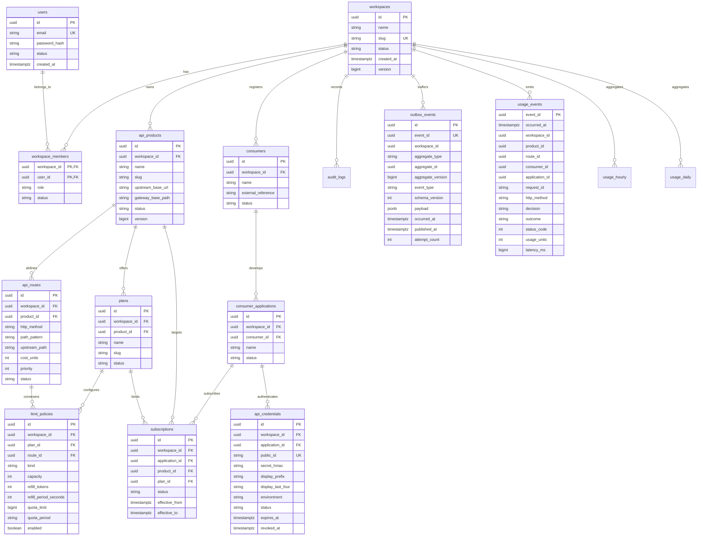

# 02. Database Schema and Migrations

This document provides the authoritative database reference for **MeterForge**, including entity-relationship diagrams, table definitions, indexing strategies, and the Flyway migration lifecycle.

---

## 1. Relational Database Architecture

- **Engine**: PostgreSQL 17
- **Schema**: `meterforge`
- **Identifier Strategy**: UUID primary keys generated cryptographically (`java.util.UUID` / `gen_random_uuid()`).
- **Naming Conventions**: `snake_case` in SQL; `camelCase` in Java & JSON DTOs.
- **Time Representation**: Always UTC with timezone (`TIMESTAMPTZ` in PostgreSQL, `java.time.Instant` in Java).
- **Concurrency Control**: Mutable entities feature an incrementing `version BIGINT NOT NULL DEFAULT 0` column for optimistic locking.
- **Multi-Tenancy**: Every tenant-owned table strictly includes and indexes `workspace_id`.
- **Migration Authority**: Only the `control-plane` module executes Flyway migrations on startup.

---

## 2. Entity-Relationship Diagram (ERD)

---

## 3. Table Catalog and Specifications

### Core Tenant & Staff Tables

#### `meterforge.workspaces`
Represents an API provider organization (tenant boundary).
- `id` (UUID, PK): Unique workspace identifier.
- `name` (VARCHAR): Display name (e.g., `Acme APIs`).
- `slug` (VARCHAR, UNIQUE): URL-safe identifier (e.g., `acme-apis`).
- `status` (VARCHAR): `ACTIVE`, `SUSPENDED`.

#### `meterforge.users`
Staff accounts permitted to access the control plane.
- `id` (UUID, PK): Unique staff user ID.
- `email` (VARCHAR, UNIQUE): Login email.
- `password_hash` (VARCHAR): BCrypt password hash.
- `status` (VARCHAR): `ACTIVE`, `DISABLED`.

#### `meterforge.workspace_members`
RBAC association mapping staff users to workspaces.
- `(workspace_id, user_id)` (Composite PK, FKs).
- `role` (VARCHAR): `OWNER` (Full access & member management), `MEMBER` (Catalog CRUD), `VIEWER` (Read-only).
- *Invariant*: A workspace must maintain at least one active `OWNER`.

---

### Catalog & Routing Tables

#### `meterforge.api_products`
Represents a logical protected backend service.
- `upstream_base_url` (VARCHAR): Target service URL (e.g., `http://wiremock:8080`).
- `gateway_base_path` (VARCHAR): Public gateway route prefix (e.g., `/v1/weather`).
- *Constraint*: `UNIQUE (workspace_id, slug)` and `UNIQUE (workspace_id, gateway_base_path)`.

#### `meterforge.api_routes`
Configured route patterns under a product.
- `http_method` (VARCHAR): `GET`, `POST`, `PUT`, `DELETE`, `PATCH`, `*`.
- `path_pattern` (VARCHAR): Supported syntax includes static (`/forecast`), parameterized (`/forecast/{city}`), and terminal wildcard (`/files/**`).
- `cost_units` (INT, CHECK `>= 1`): Multiplier cost deducted against token buckets (default: 1).
- `priority` (INT, CHECK `>= 0`): Tie-breaking priority during route matching.

---

### Consumers & API Credentials

#### `meterforge.consumers` & `meterforge.consumer_applications`
- **Consumer**: External organization or client entity.
- **Consumer Application**: Specific software client (e.g., `Mobile iOS App`, `Backend Sync Service`).

#### `meterforge.api_credentials`
Cryptographic API keys issued to applications.
- `public_id` (VARCHAR(64), UNIQUE): 16-character public identifier for O(1) Redis lookups (e.g., `nsdemo123456`).
- `secret_hmac` (VARCHAR(255)): `HMAC-SHA-256(serverPepper, canonicalFullKey)`. **Raw keys are never persisted.**
- `display_prefix` / `display_last_four`: Safe display fragments for the UI (e.g., `mf_dev_nsde...9a8`).
- `environment` (VARCHAR): `dev`, `staging`, `prod`.

---

### Plans, Policies & Subscriptions

#### `meterforge.plans` & `meterforge.limit_policies`
- **Plan**: A reusable tier of policies (e.g., `Free Tier`, `Enterprise Tier`).
- **Limit Policy Kind**:
  - `RATE` (Token Bucket): Requires `capacity`, `refill_tokens`, `refill_period_seconds`.
  - `QUOTA` (Fixed Window): Requires `quota_limit`, `quota_period` (`DAY` or `MONTH`).
- `route_id`: When `NULL`, applies product-wide. When populated, applies specifically to that route as an additional restriction.

#### `meterforge.subscriptions`
Binds an application to a product plan.
- *Constraint*: `uq_active_app_product_sub UNIQUE (application_id, product_id) WHERE (status = 'ACTIVE')`. Only **one active subscription** is permitted per application per product at any given time.

---

### Outbox, Audit & Telemetry Tables

#### `meterforge.outbox_events`
Implements the **Transactional Outbox Pattern** to prevent distributed dual-write inconsistencies.
- `event_id` (UUID, UNIQUE): Globally unique event identifier.
- `aggregate_type` / `aggregate_id` / `aggregate_version`: Monotonic versioning for cache projection ordering.
- `payload` (JSONB): Fully materialized snapshot of the changed entity.
- `published_at` (TIMESTAMPTZ, NULLable): Marked when successfully acknowledged by Kafka `meterforge.config.v1`.

#### `meterforge.usage_events`
Immutable raw telemetry records streamed by Gateway instances.
- `event_id` (UUID, PK): Emitted by Gateway on every decision (`ALLOWED`, `RATE_LIMITED`, `UNAUTHORIZED`, `BLOCKED`).
- `usage_units` (INT): Units consumed (always `0` for denied requests; `>= 1` for admitted requests).
- `latency_ms` (BIGINT): Upstream round-trip duration in milliseconds.

#### `meterforge.usage_hourly` & `meterforge.usage_daily`
Pre-aggregated rollups updated atomically via SQL `UPSERT` statements.
- `bucket_start` (TIMESTAMPTZ): Start of the hour or day window.
- `CONSTRAINT uq_usage_hourly UNIQUE NULLS NOT DISTINCT (bucket_start, workspace_id, product_id, route_id, consumer_id, application_id, subscription_id, decision, status_class)`.
- Prevents double-counting across multi-dimensional grouping.

---

## 4. Flyway Migrations Timeline

Migrations are located in [`backend/control-plane/src/main/resources/db/migration`](file:///c:/Users/dhrubo/projects/meterforge/backend/control-plane/src/main/resources/db/migration):

| Migration Version | Description | Key Tables / Actions |
|---|---|---|
| **`V1__init_schema.sql`** | Initial platform foundation | Created `meterforge` schema, `users`, `workspaces`, `workspace_members`, `api_products`, `api_routes`, `audit_logs`, and `outbox_events`. |
| **`V2__seed_demo_data.sql`** | Milestone M1 demo seed | Seeded `Acme APIs` workspace, `Weather API` product, `GET /v1/forecast/{city}` route, and demo staff logins (`owner@...`, `member@...`, `viewer@...`). |
| **`V3__m2_consumers_credentials_plans_subscriptions.sql`** | Consumer & policy schema | Created `consumers`, `consumer_applications`, `api_credentials`, `plans`, `limit_policies`, and `subscriptions`. |
| **`V4__seed_m2_demo_data.sql`** | Milestone M2 demo seed | Seeded `Northstar Labs` consumer, `Northstar Demo App`, `Free Tier` plan (5 tokens/10s + 100/day quota), dev API key, and active subscription. |
| **`V5__m4_usage_events_and_aggregations.sql`** | Usage telemetry pipeline | Created `usage_events`, `usage_hourly`, and `usage_daily` with `UNIQUE NULLS NOT DISTINCT` composite constraints. |

---

Next, proceed to **[03. Codebase & Class Hierarchy](./03_codebase_and_class_hierarchy.md)** to explore the Java and Next.js package structure.
