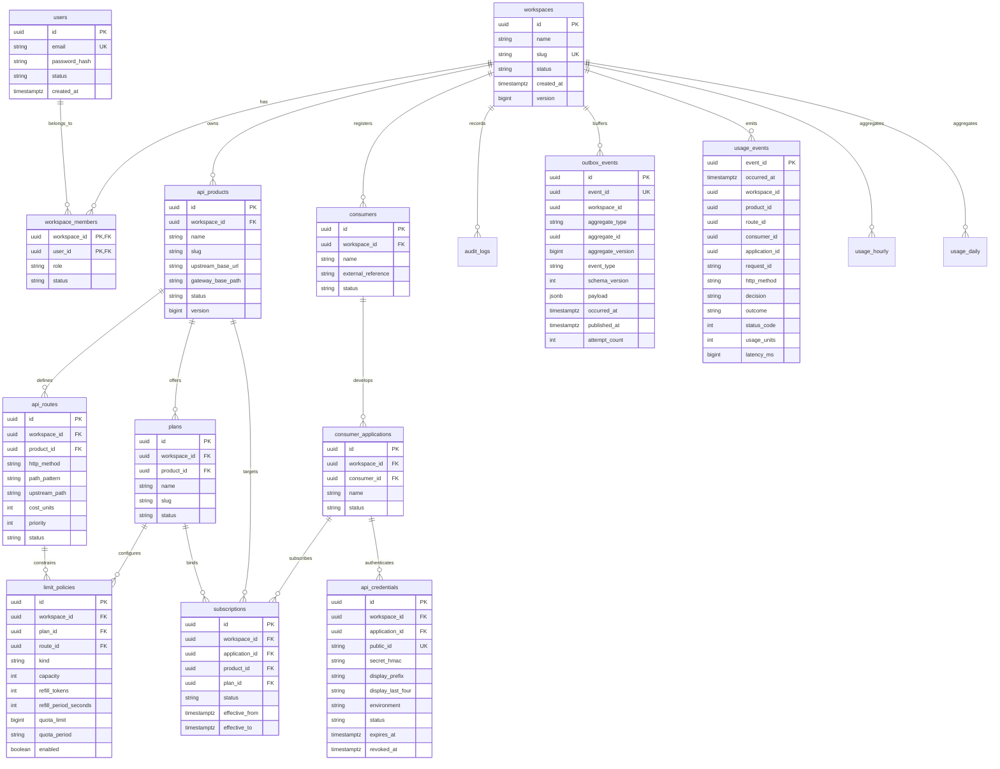

# MeterForge — The Complete Developer Handbook & Engineering Guide

> **A Centralized, Comprehensive Engineering Manual for MeterForge**  
> *High-Performance API Rate Limiting & Metering Platform (Portfolio Edition)*

---

## Table of Contents

- [Chapter 0: Executive Overview & Mental Model](#chapter-0-executive-overview--mental-model)
  - [What is MeterForge?](#what-is-meterforge)
  - [Core Domain Vocabulary](#core-domain-vocabulary)
  - [5-Minute Quickstart](#5-minute-quickstart)
- [Chapter 1: Distributed Architecture & Invariants](#chapter-1-distributed-architecture--invariants)
  - [System Topology Diagram](#system-topology-diagram)
  - [Deployable Units & Boundaries](#deployable-units--boundaries)
  - [Infrastructure Backbone](#infrastructure-backbone)
  - [The 10 Architectural Invariants](#the-10-architectural-invariants)
- [Chapter 2: Relational Database Schema & Migrations](#chapter-2-relational-database-schema--migrations)
  - [Database Architecture Conventions](#database-architecture-conventions)
  - [Entity-Relationship Diagram (ERD)](#entity-relationship-diagram-erd)
  - [Table-by-Table Technical Catalog](#table-by-table-technical-catalog)
  - [Flyway Migrations Timeline](#flyway-migrations-timeline)
- [Chapter 3: Codebase Structure & Class Hierarchy](#chapter-3-codebase-structure--class-hierarchy)
  - [Maven Multi-Module Organization](#maven-multi-module-organization)
  - [Contracts Module (`backend/contracts`)](#contracts-module-backendcontracts)
  - [Control Plane (`backend/control-plane`)](#control-plane-backendcontrol-plane)
  - [Reactive API Gateway (`backend/gateway`)](#reactive-api-gateway-backendgateway)
  - [Background Worker (`backend/worker`)](#background-worker-backendworker)
  - [Next.js Operations Frontend (`frontend/web`)](#nextjs-operations-frontend-frontendweb)
- [Chapter 4: Core Runtime Flows & Distributed Algorithms](#chapter-4-core-runtime-flows--distributed-algorithms)
  - [Flow 1: Control-Plane Mutation & Transactional Outbox](#flow-1-control-plane-mutation--transactional-outbox)
  - [Flow 2: Outbox Propagation & Versioned Redis Projection](#flow-2-outbox-propagation--versioned-redis-projection)
  - [Flow 3: Gateway Proxying & Atomic Redis Lua Limiter](#flow-3-gateway-proxying--atomic-redis-lua-limiter)
  - [Flow 4: Telemetry Streaming & Idempotent SQL Aggregations](#flow-4-telemetry-streaming--idempotent-sql-aggregations)
- [Chapter 5: Developer Cheatsheet, Testing & Inspection](#chapter-5-developer-cheatsheet-testing--inspection)
  - [Local Development Workflows](#local-development-workflows)
  - [Automated Testing & Testcontainers](#automated-testing--testcontainers)
  - [Seeded Demo Environment & Traffic Scripts](#seeded-demo-environment--traffic-scripts)
  - [Live Data Store Inspection (Redis, Kafka, PostgreSQL)](#live-data-store-inspection-redis-kafka-postgresql)
  - [Definition of Done & Code Standards](#definition-of-done--code-standards)

---

# Chapter 0: Executive Overview & Mental Model

## What is MeterForge?

**MeterForge** is a production-grade, multi-tenant API rate limiting, quota enforcement, and usage metering platform. It is engineered to demonstrate how to solve complex distributed systems challenges:

1. **Atomic Multi-Policy Enforcement**: Evaluating multiple token-bucket rate limits and fixed-window calendar quotas across distributed gateway instances without race conditions or partial token deductions.
2. **Zero-Database Gateway Core**: Running a high-throughput reactive HTTP proxy that operates entirely from in-memory Redis configuration projections and Kafka publishing, completely decoupled from relational databases.
3. **Dual-Write Consistency**: Eliminating inconsistencies between PostgreSQL mutations and Kafka event streams using the **Transactional Outbox Pattern**.
4. **Idempotent Telemetry Pipeline**: Aggregating raw request metrics over at-least-once Kafka message streams with exact-deduplication database transactions.
5. **Secure Cryptographic Key Lifecycle**: Managing 256-bit API keys with HMAC-SHA256 server-peppered verification where raw secrets are displayed strictly once and never persisted.

---

## Core Domain Vocabulary

Use these canonical terms across all domain entities, database tables, APIs, code, and UI:

```text
Workspace
   └── User Memberships (OWNER, MEMBER, VIEWER)
   └── API Products
        └── API Routes (Cost Units, Priority)
        └── Plans
             └── Limit Policies (RATE / Token Bucket, QUOTA / Fixed Window)
   └── Consumers
        └── Consumer Applications
             └── API Credentials (HMAC hashed, never raw)
             └── Subscriptions (Application + Product + Plan)
```

- **Workspace**: A single API provider tenant (e.g., `Acme APIs`). All tenant-owned rows contain a `workspace_id`.
- **Product**: A protected logical backend API service (e.g., `Weather API`) mapping to an upstream base URL.
- **Route**: An HTTP method and path pattern within a product (e.g., `GET /v1/forecast/{city}`).
- **Consumer**: An external business or client organization consuming the APIs (e.g., `Northstar Labs`).
- **Application**: A specific software client owned by a consumer (e.g., `Northstar Demo App`).
- **Credential**: An API key issued to an application (`mf_<env>_<publicId>_<secret>`).
- **Plan**: A reusable set of rate and quota limit policies for a product (e.g., `Free Tier`, `Enterprise Plan`).
- **Subscription**: The active binding of a product plan to a consumer application.
- **Rate Policy**: Short-term token-bucket rule (capacity, refill tokens, refill period seconds).
- **Quota Policy**: Long-term fixed-window allowance (calendar day or month allowance in usage units).
- **Usage Unit**: The integer weight/cost consumed when a route is matched (default: 1).

---

## 5-Minute Quickstart

### Turnkey Launch via Docker Compose
```bash
# 1. Build and run all 8 containers
docker compose up --build -d

# 2. Open Operations UI in your browser
http://localhost:3001

# 3. Log in with Seeded Admin Credentials
Email: owner@meterforge.local
Password: password123

# 4. Open Request Lab & Test Concurrency Burst
Navigate to "Request Lab" (/acme-apis/lab) -> Click "Fire Burst (10 Requests)"
Result: Exactly 5 Allowed (200 OK) + 5 Blocked (429 Rate Limited)
```

---

# Chapter 1: Distributed Architecture & Invariants

## System Topology Diagram

```text
Browser -> Next.js Web UI -> Control Plane -> PostgreSQL (Source of Truth)
                                    │
                              outbox_events
                                    ▼
                                  Kafka (meterforge.config.v1)
                                    │
                                    ▼
                          Worker Service -> Redis Config Projections
                                    │
                                    ▼ (meterforge.usage.v1)
Consumer -> Reactive Gateway -> Redis Lua -> Upstream WireMock / Target API
                  │
                  └─── Usage Recorded Event (Kafka)
                                    │
                                    ▼
                          Worker Ingestion -> PostgreSQL (usage_events & rollups)
```

---

## Deployable Units & Boundaries

| Component | Technology | Primary Responsibilities | Strict Non-Responsibilities |
|---|---|---|---|
| **`control-plane`** | Spring Boot 3.4 (MVC / JPA) | Staff auth, RBAC, CRUD, Transactional Outbox, Usage query APIs. | Never proxy traffic; never calculate limiter tokens. |
| **`gateway`** | Spring Cloud Gateway (WebFlux) | Pure reactive proxy, API key auth, route matching, atomic Redis Lua limiter, Kafka event publishing. | **Never query PostgreSQL** (zero database credentials/drivers). |
| **`worker`** | Spring Boot 3.4 (Kafka / JDBC) | Outbox poller, Redis cache projector, Kafka usage telemetry ingestion, SQL rollup aggregations. | Never serve public HTTP UI APIs. |
| **`web`** | Next.js 16 (React 19 / TS) | Operations dashboard, API key dialog, Request Lab burst simulator, Analytics viewer. | Never access databases or Kafka directly. |
| **`contracts`** | Shared Java Library | Common event envelopes, DTOs, projections, and enums. | Zero framework dependencies. |

---

## Infrastructure Backbone

1. **PostgreSQL 17**: Relational source of truth (`meterforge` schema), owned and migrated exclusively by the `control-plane` using Flyway.
2. **Redis 7 (Alpine + AOF)**: Data plane in-memory store for configuration projections (`rf:v1:cfg:...`) and authoritative live counters (`rf:v1:rate:...`, `rf:v1:quota:...`).
3. **Apache Kafka 3.9 (KRaft)**: Event backbone with topics `meterforge.config.v1` (config changes) and `meterforge.usage.v1` (telemetry stream).
4. **WireMock**: Upstream mock server simulating target microservices on port `9990`.

---

## The 10 Architectural Invariants

1. **Gateway Never Touches PostgreSQL**: The gateway operates purely on in-memory Redis projections and Kafka publishing.
2. **Atomic Rate Decisions in Redis Lua**: All rate and quota policies for a request are evaluated in **one atomic Lua script invocation** using Redis server `TIME`. Zero Java read-modify-write races.
3. **All-or-Nothing Limit Enforcement**: If any applicable policy denies the request, **no counters are mutated**, and an HTTP 429 is returned.
4. **Availability-First Gateway Telemetry**: Gateway proxies traffic even during transient Kafka degradation using bounded in-memory publisher buffers.
5. **Idempotent Usage Ingestion**: Kafka delivery is at-least-once. The worker executes `INSERT INTO usage_events ... ON CONFLICT (event_id) DO NOTHING`. Aggregates are incremented only when raw inserts succeed.
6. **No Raw API Keys Stored**: API keys are generated via 256-bit `SecureRandom`, shown strictly once, and hashed using HMAC-SHA-256 with a server-side pepper before storage.
7. **Transactional Outbox Pattern**: Entity mutations, audit logs, and versioned `ConfigEventEnvelope` rows are committed in the **exact same PostgreSQL transaction**.
8. **Monotonic Version Fencing in Redis**: Config events carry an `aggregateVersion`. Older or duplicate events are discarded if Redis already holds a newer version (`rf:v1:cfg:version:<type>:<id>`).
9. **Strict Workspace Isolation**: Every tenant query is scoped by `workspace_id` verified server-side via authenticated session JWTs.
10. **Zero Secrets in Logs or Events**: Never log or emit raw API keys, HMAC verifiers, JWT tokens, cookies, or payloads.

---

# Chapter 2: Relational Database Schema & Migrations

## Database Architecture Conventions

- Schema: `meterforge`
- Primary Keys: UUID (`java.util.UUID` / `gen_random_uuid()`)
- Timestamps: Always UTC with timezone (`TIMESTAMPTZ` in PostgreSQL)
- Concurrency: `version BIGINT NOT NULL DEFAULT 0` for optimistic locking

---

## Entity-Relationship Diagram (ERD)



---

## Table-by-Table Technical Catalog

### 1. `meterforge.workspaces` & `meterforge.users`
- Manages tenant boundaries and staff credentials.
- `workspace_members` enforces roles (`OWNER`, `MEMBER`, `VIEWER`) with a guarantee of at least one active owner per workspace.

### 2. `meterforge.api_products` & `meterforge.api_routes`
- `api_products` binds an upstream URL to a public `gateway_base_path`.
- `api_routes` supports static, parameterized (`{param}`), and wildcard (`**`) path syntax with configurable integer `cost_units` and match `priority`.

### 3. `meterforge.consumers`, `meterforge.consumer_applications` & `meterforge.api_credentials`
- `api_credentials` stores `public_id` (16 chars) for O(1) Redis lookup and `secret_hmac` (HMAC-SHA-256). **Raw secrets are never saved.**

### 4. `meterforge.plans`, `meterforge.limit_policies` & `meterforge.subscriptions`
- `limit_policies` enforces check constraints ensuring `RATE` policies contain token-bucket fields and `QUOTA` policies contain window fields.
- `subscriptions` enforces `UNIQUE(application_id, product_id) WHERE status = 'ACTIVE'`.

### 5. `meterforge.outbox_events`
- Implements the Transactional Outbox Pattern with monotonic aggregate versioning and retry tracking.

### 6. `meterforge.usage_events`, `meterforge.usage_hourly` & `meterforge.usage_daily`
- `usage_events` records raw gateway telemetry.
- `usage_hourly` and `usage_daily` maintain pre-calculated metrics using `UNIQUE NULLS NOT DISTINCT` composite keys for atomic SQL upserts.

---

## Flyway Migrations Timeline

- **`V1__init_schema.sql`**: Foundation schema (users, workspaces, members, products, routes, audit, outbox).
- **`V2__seed_demo_data.sql`**: Seeded `Acme APIs` workspace, `Weather API`, and demo staff logins.
- **`V3__m2_consumers_credentials_plans_subscriptions.sql`**: Consumer, application, credential, plan, and subscription DDL.
- **`V4__seed_m2_demo_data.sql`**: Seeded `Northstar Labs`, `Free Tier` plan (5 tokens/10s + 100/day), and active subscription.
- **`V5__m4_usage_events_and_aggregations.sql`**: Usage telemetry, hourly rollups, and daily rollups DDL.

---

# Chapter 3: Codebase Structure & Class Hierarchy

## Maven Multi-Module Organization

The backend is built as a single Maven reactor under Java 25 LTS:

```text
meterforge (Root pom.xml)
├── contracts        (JVM library, 0 dependencies)
├── control-plane    (Spring Boot 3.4 MVC, Spring Data JPA, Flyway, JJWT)
├── gateway          (Spring Cloud Gateway WebFlux, Reactive Redis, Kafka)
└── worker           (Spring Boot 3.4, Spring Kafka, Spring Data Redis, Spring JDBC)
```

---

## Key Classes by Module

### 1. Contracts Module (`backend/contracts`)
- **`ConfigEventEnvelope<T>`**: Standard JSON envelope for outbox configuration events.
- **`UsageRecordedV1`**: Telemetry event published by the gateway on every decision.
- **`CredentialProjection`**, **`ProductProjection`**, **`SubscriptionProjection`**: Cached data plane models stored in Redis.

### 2. Control Plane (`backend/control-plane`)
- **`AuthController`** & **`AuthService`**: Issues signed JWTs stored in HttpOnly session cookies.
- **`WorkspaceSecurityService`**: Server-side RBAC resolver enforcing tenant authorization.
- **`ProductService`** & **`RouteService`**: Manages API products and route ambiguity detection.
- **`CredentialService`**: Generates 256-bit CSPRNG API keys and computes server-peppered HMAC-SHA256 hashes.
- **`PlanService`** & **`SubscriptionService`**: Manages multi-tier rate/quota plans.
- **`OutboxEventPublisher`**: Writes versioned outbox rows in the current JPA transaction.
- **`UsageService`**: Queries raw telemetry, timeseries buckets, and top routes/apps.

### 3. Reactive API Gateway (`backend/gateway`)
- **`GatewayProxyFilter`**: Reactive WebFlux global filter orchestrating authentication, rate limiting, forwarding, and telemetry.
- **`ApiKeyAuthenticator`** & **`ApiKeyHmacVerifier`**: Extracts public IDs, loads Redis projections, and performs constant-time HMAC validation via `MessageDigest.isEqual`.
- **`ProductRouteMatcher`**: Evaluates routes with specificity scoring (`Static > Parameterized > Wildcard > Segment Length > Priority`).
- **`LuaRateLimiter`**: Executes `rate_limiter.lua` atomically in Redis.
- **`UsageEventPublisher`**: Non-blocking Kafka producer for `meterforge.usage.v1`.

### 4. Background Worker (`backend/worker`)
- **`OutboxPollerService`**: `@Scheduled` poller querying `outbox_events` and publishing batches to Kafka `meterforge.config.v1`.
- **`ConfigProjectionConsumer`**: Kafka listener projecting snapshots to Redis with version fencing.
- **`UsageIngestionConsumer`** & **`UsageIngestionService`**: High-throughput Kafka consumer batch-inserting into PostgreSQL and incrementing hourly/daily rollups.

### 5. Next.js Operations Frontend (`frontend/web`)
- **`app/api/[...path]/route.ts`**: Transparent dynamic API route handler forwarding client requests to the Control Plane at runtime.
- **`app/[workspaceSlug]/lab/page.tsx`**: Interactive concurrency burst Request Lab.
- **`app/[workspaceSlug]/usage/page.tsx`**: Multi-dimensional usage analytics dashboard.
- **`lib/api/*`**: Typed API client layer built on TanStack React Query v5.

---

# Chapter 4: Core Runtime Flows & Distributed Algorithms

## Flow 1: Control-Plane Mutation & Transactional Outbox

```text
HTTP Request (Staff JWT)
   │
   ▼
AuthController / WorkspaceSecurityService (RBAC check)
   │
   ▼
[ ONE POSTGRESQL TRANSACTION ]
   ├── 1. INSERT / UPDATE target entity (e.g., api_credentials)
   ├── 2. INSERT INTO audit_logs (Summary, metadata, request_id)
   └── 3. INSERT INTO outbox_events (ConfigEventEnvelope snapshot)
   │
   ▼
[ COMMIT TRANSACTION ]
   │
   ▼
HTTP 200 / 201 Response (Raw secret returned once if key creation)
```

---

## Flow 2: Outbox Propagation & Versioned Redis Projection

```text
OutboxPollerService (@Scheduled 500ms)
   │
   ├── SELECT * FROM outbox_events WHERE published_at IS NULL AND attempt_count < 10
   ├── KafkaTemplate.send("meterforge.config.v1", event.eventId, envelope)
   └── UPDATE outbox_events SET published_at = NOW() WHERE event_id = ?
              │
              ▼ (Kafka meterforge.config.v1)
ConfigProjectionConsumer (Worker)
   │
   ├── 1. Read aggregateType, aggregateId, aggregateVersion from envelope
   ├── 2. GET rf:v1:cfg:version:<aggregateType>:<aggregateId> from Redis
   │
   ├── IF aggregateVersion <= currentVersion:
   │      └── IGNORE (Out-of-order or duplicate event; discard safely)
   │
   └── IF aggregateVersion > currentVersion:
          ├── A. Write JSON projection to Redis:
          │      - rf:v1:cfg:credential:<publicId>
          │      - rf:v1:cfg:product:<productId>
          │      - rf:v1:cfg:subscription:<subscriptionId>
          ├── B. Maintain active product set: SADD / SREM rf:v1:cfg:products
          └── C. SET rf:v1:cfg:version:<aggregateType>:<aggregateId> = aggregateVersion
```

---

## Flow 3: Gateway Proxying & Atomic Redis Lua Limiter

```text
Consumer HTTP Request (e.g., GET /v1/forecast/london with X-API-Key)
   │
   ▼
GatewayProxyFilter (Global WebFlux Filter)
   │
   ├── 1. Sanitize or generate X-Request-ID
   ├── 2. ProductRouteMatcher (specificity matching via Caffeine L1 / Redis active set)
   ├── 3. ApiKeyAuthenticator (constant-time HMAC-SHA256 verification)
   ├── 4. SubscriptionResolver (loads SubscriptionProjection from Redis)
   │
   ├── 5. LuaRateLimiter (ONE atomic Redis call to rate_limiter.lua):
   │      - Gets Redis server TIME
   │      - Refills token buckets based on elapsed time
   │      - Checks all token bucket capacities >= costUnits
   │      - Checks all fixed-window quota allowances >= costUnits
   │      - IF ANY FAILS: Returns denied, mutates NOTHING
   │      - IF ALL PASS: Deducts tokens, increments quotas, sets TTLs, returns allowed
   │
   ├── [RATE LIMITED] ──> Return 429 + Publish UsageRecordedV1 (units=0, outcome=NOT_FORWARDED)
   ├── [REDIS ERROR]  ──> Return 503 + Publish UsageRecordedV1 (decision=BLOCKED, outcome=UNAVAILABLE)
   └── [ALLOWED]      ──> Strip X-API-Key, proxy to WireMock, stream response, publish UsageRecordedV1
```

---

## Flow 4: Telemetry Streaming & Idempotent SQL Aggregations

```text
Kafka meterforge.usage.v1
   │
   ▼
UsageIngestionConsumer (Worker batch listener)
   │
   ▼
UsageIngestionService (Spring JdbcClient)
   │
   ▼
[ ONE POSTGRESQL TRANSACTION ]
   │
   ├── Step 1: Raw Event Deduplication
   │   INSERT INTO meterforge.usage_events (...) VALUES (...)
   │   ON CONFLICT (event_id) DO NOTHING;
   │
   └── Step 2: Atomic Rollups (Only executed if Step 1 inserted rows > 0)
       ├── Hourly Rollup:
       │   INSERT INTO meterforge.usage_hourly (...) VALUES (...)
       │   ON CONFLICT (bucket_start, workspace_id, product_id, route_id, consumer_id, application_id, subscription_id, decision, status_class)
       │   DO UPDATE SET total_requests = usage_hourly.total_requests + 1, total_units = usage_hourly.total_units + EXCLUDED.total_units;
       │
       └── Daily Rollup:
           INSERT INTO meterforge.usage_daily (...) VALUES (...)
           ON CONFLICT (...) DO UPDATE SET total_requests = usage_daily.total_requests + 1;
   │
   ▼
[ COMMIT TRANSACTION ]
   │
   ▼
Acknowledge Kafka Consumer Offset
```

---

# Chapter 5: Developer Cheatsheet, Testing & Inspection

## Local Development Workflows

### Option A: Complete Docker Compose Stack
```bash
docker compose up --build -d
docker compose logs -f
docker compose down
```

### Option B: Local Hybrid Development (Recommended for Fast Coding)
```bash
# 1. Start background infrastructure in Docker
docker compose up -d postgres redis kafka wiremock

# 2. Run backend services locally in separate terminal tabs:
./mvnw -pl backend/control-plane spring-boot:run
./mvnw -pl backend/gateway spring-boot:run
./mvnw -pl backend/worker spring-boot:run

# 3. Run frontend dev server:
cd frontend/web && pnpm dev
```

---

## Automated Testing & Testcontainers

```bash
# Run all backend unit & Testcontainers integration tests
./mvnw test

# Run full project verify
./mvnw verify

# Targeted Testcontainers Integration Suites:
./mvnw -pl backend/gateway test -Dtest=GatewayLimiterIntegrationTests
./mvnw -pl backend/control-plane test -Dtest=ApiKeyHmacConsistencyTests
./mvnw -pl backend/worker test -Dtest=WorkerProjectionIntegrationTests
./mvnw -pl backend/worker test -Dtest=UsageIngestionIntegrationTests

# Frontend Vitest & TypeScript typecheck:
cd frontend/web
pnpm test
pnpm typecheck
```

---

## Seeded Demo Environment & Traffic Scripts

| Resource | Value | Notes |
|---|---|---|
| **Web UI** | `http://localhost:3001` (Docker) / `http://localhost:3000` (Dev) | Next.js Dashboard |
| **Owner Staff Login** | `owner@meterforge.local` / `password123` | Full permissions |
| **Member Staff Login** | `member@meterforge.local` / `password123` | Catalog CRUD |
| **Viewer Staff Login** | `viewer@meterforge.local` / `password123` | Read-only |
| **Seeded Product** | `Weather API` (`/v1/forecast`) | Base Path |
| **Seeded Plan** | `Free Tier` | 5 capacity, refill 5 every 10s, 100/day quota |
| **Seeded API Key** | `mf_dev_nsdemo123456_f9a8b7c6d5e4f3a2b1c0d9e8f7a6b5c4d3e2f1a0b9c8d7e6f5a4b3c2d1e0f9a8` | Public ID: `nsdemo123456` |

### Triggering Automated Traffic Bursts

#### PowerShell:
```powershell
.\scripts\demo_traffic.ps1 -GatewayUrl "http://localhost:8890" -Count 10
```

#### Bash / cURL:
```bash
./scripts/demo_traffic.sh -u "http://localhost:8890" -c 10
```

---

## Live Data Store Inspection (Redis, Kafka, PostgreSQL)

```bash
# Redis CLI
docker compose exec redis redis-cli
> KEYS rf:v1:cfg:*
> GET rf:v1:cfg:credential:nsdemo123456
> HGETALL "rf:v1:rate:{bbbbbbbb-bbbb-bbbb-bbbb-bbbbbbbbbbbb}:11111111-1111-1111-1111-111111111111"

# Kafka Telemetry Console Consumer
docker compose exec kafka /opt/kafka/bin/kafka-console-consumer.sh \
  --bootstrap-server localhost:9092 \
  --topic meterforge.usage.v1 \
  --from-beginning

# PostgreSQL Direct Inspection
docker compose exec postgres psql -U meterforge -d meterforge
> SELECT event_id, decision, status_code, usage_units, latency_ms FROM meterforge.usage_events ORDER BY occurred_at DESC LIMIT 5;
> SELECT bucket_start, total_requests, total_units FROM meterforge.usage_hourly ORDER BY bucket_start DESC;
```

---

## Definition of Done & Code Standards

1. **Architecture Preserved**: Gateway contains **zero SQL queries** and makes all rate decisions in **one atomic Lua call**.
2. **Migrations & Entities Aligned**: Any schema change is accompanied by an append-only Flyway migration script in `backend/control-plane`.
3. **No Secrets Persisted or Logged**: Raw API keys, JWTs, and HMAC verifiers are never logged or saved to the database.
4. **Automated Tests Pass**: `./mvnw clean test` and `pnpm typecheck && pnpm test` pass with 0 errors.
5. **No Dual-Write Bugs**: Outbox rows and entity state commit in the same database transaction.
6. **Clean Codebase**: No dead code, dangling `TODO`s, or uncommented hacks.
